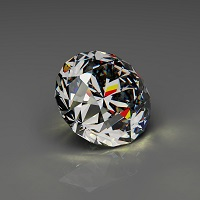
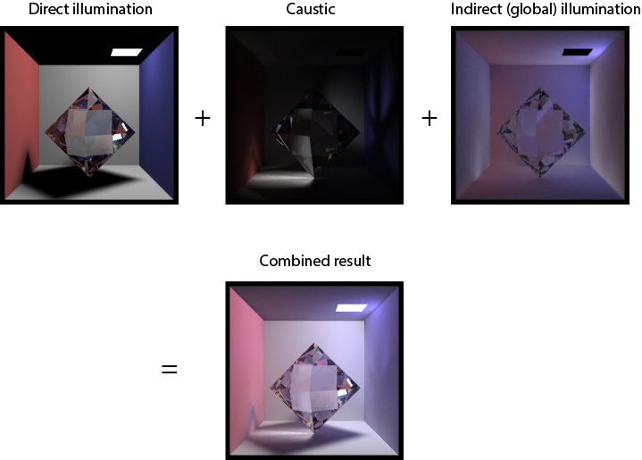

# SC Tracer

This is a ray tracer written in C++ from the scratch. It is an extension of the my final project of _CSCI 580_: 3-D Graphics and Rendering course from University of Southern California. 

Key features:

* Support of triangle surface
* Direct illumination by ray tracing with area light source (soft shadow)
* Antialiasing by supersampling 
* Reflection and refraction from specular and transparent interfaces (Fresnel equation)
* Indirect illumination by distribute ray tracing and photon map
* Caustic by direct visualization of photon map
* OpenMP multithread for the ray tracing part
* CUDA C acceleration for ray tracing (in cuda folder)

